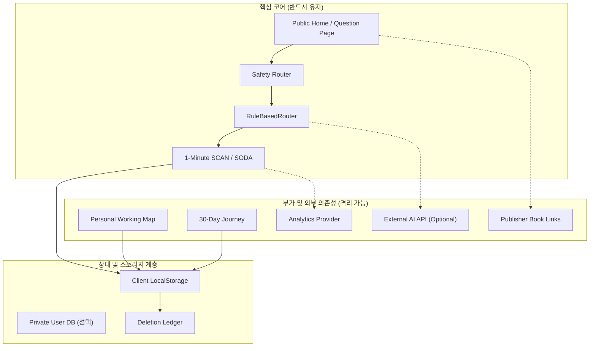

# 🗺️ 명심코칭 의존성 맵 및 단일 장애점 분석 (Dependency Map)

## 1. 서브시스템 의존성 계층도

---

## 2. 의존성 영향도 분석

| 서브시스템 | 상위 의존 대상 | 장애 발생 시 영향 | Fallback 대책 |
| :--- | :--- | :--- | :--- |
| **Public Site** | Vercel Static Hosting | 사이트 접근 불가 (SPOF) | Cloudflare Pages 즉시 미러링 |
| **Safety Router** | 로컬 사전 및 정규식 | 고위험 발화 차단 불가 | 절대 비활성화 불가, 즉각 롤백 |
| **Rule Router** | 형태소 인덱스, 카드 DB | 질문 검색 실패 | Fallback 대표 5대 카드 풀 제공 |
| **Private Save** | LocalStorage / DB | 사용자 작성 내용 저장 실패 | `READ_ONLY` 전환, 거짓 성공 방지 |
| **Analytics** | 서드파티 분석 툴 | 통계 누락 (경험 무영향) | 분석 비활성화, 코어 플로우 유지 |
| **External AI** | OpenAI / Gemini API | 하이브리드 추천 지연 | **100% RuleBasedRouter 자립 가동** |
| **Book URLs** | 출판사 웹사이트 | 외부 구매 링크 404 | 링크 숨김 또는 안내 처리 |

---

## 3. 단일 장애점(SPOF) 완화 전략
1. **정적 호스팅 단일점**: 순수 HTML/JS 번들로 빌드되어 있어, 호스팅 제공자 장애 시 타 클라우드 스토리지(S3, Cloudflare, Netlify)로 10분 내 전환 배포 가능.
2. **AI 의존성 단일점 원천 제거**: 상용 LLM 서버가 전 세계적으로 다운되더라도 명심코칭은 100% 정상 작동 (`External AI: Optional`).
