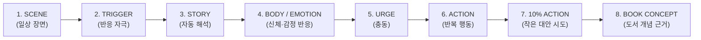

# MYUNGSIM Knowledge Graph Overview

## 1. 개요 및 목적 (Purpose)
명심코칭(MyungSim Coaching) 지식 그래프(Knowledge Graph v1)는 카드가 200장, 300장, 그 이상으로 확장되어도 독립된 단편 콘텐츠로 흩어지지 않고, **하나의 구조화된 지식체계**로 연결되도록 관리하는 최상위 온톨로지 엔진입니다.

---

## 2. 가장 중요한 3대 경계 (Core Boundaries)

### 1) 콘텐츠 지식 그래프 (Content Knowledge Graph)
- 본 그래프는 순수하게 **명심코칭의 콘텐츠 및 장면-기제 체계**를 나타냅니다.
- **사용자 개인을 심리적으로 진단하거나 분류하는 'User Psychological Graph'가 결코 아닙니다.**
- "사용자 A → 회피형 애착 → 자존감 결핍"과 같은 개인 프로파일링은 시스템 레벨에서 원천 차단됩니다.

### 2) Personal Working Map과의 엄격한 분리
- 사용자의 사적인 기록과 최근 선택 패턴은 오직 사용자 로컬의 `Personal Working Map`에만 머뭅니다.
- 공용 지식 그래프는 개인 지도로부터 어떠한 사적 원문도 학습하거나 역유입하지 않습니다.

### 3) 안전 최우선 원칙 (Safety Precedence)
- 자해, 타해, 폭력, 스토킹 등 위기 신호가 감지되면 지식 그래프 탐색은 즉시 중단되며, 비의료 응급 안전 라우터가 최우선 발화합니다.
- 지식 그래프가 안전 프로토콜을 우회하거나 대체할 수 없습니다.
