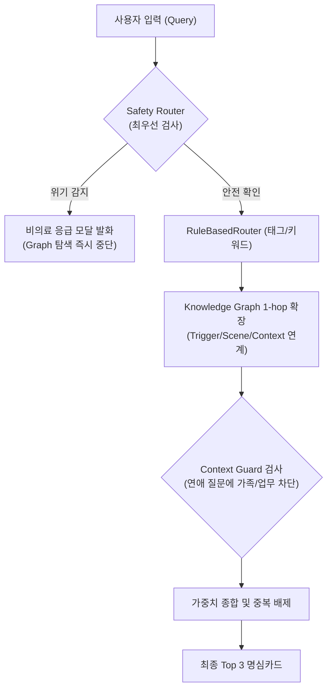

# MYUNGSIM Knowledge Graph & Router Integration Guide (라우터 통합 지침)

## 1. 개요 및 파이프라인
Knowledge Graph는 기존의 검증된 `RuleBasedRouter`를 대체하는 것이 아니라, **구조적 재현율(Recall)과 설명 가능성을 보조하는 파트너**로 동작합니다.

---

## 2. 핵심 통합 규칙

### 1) 1-Hop 탐색 원칙 (No Infinite Graph Drift)
- 사용자 입력에서 발견된 개념을 바탕으로 지식 그래프를 탐색할 때, **최대 1-hop(필요시 제한적 2-hop)**까지만 확장합니다.
- 예: `답장 없음 → 불안 → 관계 → 어린 시절 → 애착 → 트라우마`와 같은 끝없는 의미 표류(Graph Drift)는 원천 차단됩니다.

### 2) Context Guard (맥락 보호)
- 감정이 유사하더라도(`anxiety`), 질문의 맥락이 `romantic`(연애)인 경우 `family`(가족)나 `work`(직장) 카드가 상위에 오르지 않도록 보호합니다.

### 3) 100% Rule Router Fallback
- 지식 그래프 서브시스템에 장애가 발생하거나 OFF될 경우, 시스템은 에러 없이 **기존 RuleBasedRouter 단독으로 100% 정상 작동**합니다.
