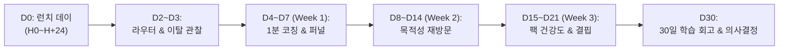

# MYUNGSIM Public Launch 30-Day Command Plan

## 1. 개요 및 지휘 철학 (Command Philosophy)

본 문서는 명심코칭(MyungSim Coaching) 공식 공개 후 30일 동안의 운영 리듬, 관제 우선순위, 의사결정 원칙을 정의한 최상위 운영 계획서입니다.

### 핵심 4대 원칙 (Four Core Principles)
1. **관제 순서의 불변성 (Observation Hierarchy)**:
   - `Safety → Privacy → System Reliability → Core Experience → Router Quality → Content Quality → Product Learning → Growth Optimization` 순서를 절대 어기지 않습니다.
   - 데이터 품질이나 안정성이 입증되지 않은 상태에서 전환율이나 잔존율을 분석하는 것은 무효입니다.
2. **동결 및 섣부른 최적화 금지 (Production Freeze & No Premature Optimization)**:
   - 런칭 직후의 소표본(N < 30) 데이터나 소수 사용자 피드백에 반응하여 카드 본문, 라우터 가중치, 핵심 UI 구조를 수정하지 않습니다.
   - P0/P1 기술적 결함, 안전 사고, 개인정보 누출 외의 모든 제품 변경은 정해진 리뷰 주기까지 동결합니다.
3. **소표본 보호 원칙 (Small-Sample Guard)**:
   - 표본 크기가 불충분할 때의 이탈이나 저조한 완료율은 `INSUFFICIENT_EVIDENCE(표본 부족)`로 분류하며, "제품 결함"으로 섣불리 단정하지 않습니다.
4. **인간 의사결정 지원 및 비도덕화 (Human Decision & Non-Moralizing)**:
   - 시스템은 임의로 자동 최적화 코드를 배포하지 않고, 30일 회고에서 `FACT / INTERPRETATION / NEXT QUESTION` 형식의 3대 스프린트 후보를 제시합니다.
   - 사용자가 10% Action이나 실험을 완료하지 못하더라도 이를 '의지 부족'으로 탓하지 않고, 행동의 크기(Action Too Big)나 타이밍의 마찰로 분석합니다.

---

## 2. 30일 마일스톤 관제 타임라인 (Milestone Timeline)

| 시점 (Milestone) | 관제 중점 (Focus) | 절대 변경 금지 (Do Not Change Today) | 의사결정 기준 (Decision Rules) |
|---|---|---|---|
| **D0: LAUNCH DAY** (0~24h) | 서버 가용성 99.9%, JS 크래시 0건, Safety/Zero-PII | 카드 문구, 라우터 가중치, UI 디자인, DB 스키마 | P0/P1 긴급 결함 외 릴리즈 전면 차단 |
| **D2~D3** (24~72h) | 라우터 오류 분류 (기술 실패 vs 콘텐츠 결핍), 스크립트 에러 | 1-Minute 코칭 스텝, 온보딩 흐름 | 라우터 매칭 실패는 Watch List 등록 후 관찰 |
| **D4~D7** (Week 1) | 1-Minute 코칭 퍼널, Action Too Big 신호, 안심 루프 감지 | 카드 태그, 팩 분류, 심리검사 추가 금지 | 주간 회고 작성, 소표본 보호 유지 |
| **D8~D14** (Week 2) | 목적성 재방문 (Return With Purpose), 실험 후속 기록 | 홈 레이아웃, 복귀 유도 푸시/알림 추가 금지 | 스트릭(연속 출석) 강요 금지, 자연 복귀 관찰 |
| **D15~D21** (Week 3) | 10개 PACK별 건강도 비교, 입증된 Content Gap 도출 | 새 PACK 즉각 추가 금지 | 검색 미매칭 빈도 10회 이상 시 차기 후보 등록 |
| **D30** (Review) | 30일 종합 회고, 3대 스프린트 후보 검토, 학습 아카이브 고정 | 자동 알고리즘 변경 금지 | 인간 운영팀이 다음 1개 스프린트 채택 |

---

## 3. 무경쟁·무외부 AI 운영 (Zero-Key Operations)
- **외부 AI API 호출 수**: `0건` (Strict Local Rule-Based Engine).
- **개인정보 보존**: 로컬 브라우저 세션 및 IndexedDB/LocalStorage 암호화 보관, 서버 전송 0건.
- **안전 프로토콜**: 자해/자살/폭력 키워드 감지 시 비의료적 응급 상담 전화 모달 즉각 팝업.
