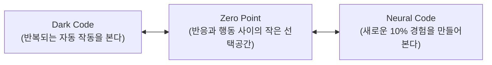

# 명심코칭 핵심 용어집 (MyungSim Terminology Dictionary)
**문서 버전:** v1.0  
**작성 일자:** 2026-09-21  
**기준 파일:** `js/myungsim-design-system.js`

---

## 1. 12대 핵심 프로덕트 용어 (Core Terms)

| 용어 (EN) | 한국어 표기 | 표준 정의 | 금지된 왜곡 표현 |
| :--- | :--- | :--- | :--- |
| **SCENE** | **장면** | 일상에서 마음에 걸리거나 반응이 일어난 구체적인 상황 | "당신의 문제", "트라우마" |
| **FACT** | **확인된 사실** | 객관적으로 벌어진, 증명 가능한 현실 | 주관적 상상과의 혼동 |
| **STORY** | **내가 붙인 의미 / 해석** | 사실이 확인되기 전에 머릿속에서 빠르게 지어낸 하나의 해석 | "거짓말", "잘못된 생각", "왜곡된 사고" |
| **UNKNOWN** | **아직 모르는 것** | 아직 확인되지 않은 현실 ("아직 모른다"). 정확성의 공간 | "회피", "무지" |
| **BODY** | **몸의 신호** | 생각보다 먼저 몸에서 올라오는 긴장, 답답함 등의 감각 | "몸이 미래/진실을 안다", "위험의 증거" |
| **EMOTION** | **지금 올라오는 감정** | 좋음/나쁨으로 나누지 않고 있는 그대로 맞이하는 정서 | 감정의 억압, 감정적 판결 |
| **URGE** | **지금 당장 하고 싶은 충동** | 확인하기, 사과하기, 도망가기 등 즉각적인 반응 충동 | 충동을 "행동 명령"으로 취급하는 것 |
| **ACTION** | **실제로 한 행동** | 충동과 분리되어 현실에서 실제로 취한 행동 | 자동 반응과의 혼동 |
| **EXPECTED** | **예상** | 행동하기 전 머릿속으로 상상했던 파국적이거나 두려운 시나리오 | "미래의 진실", "확정된 결말" |
| **ACTUAL** | **실제로 일어난 것** | 작은 시도 후 현실에서 실제로 벌어진 객관적 결과 | 결과에 대한 억지 미화 |
| **10% ACTION** | **10% 다른 행동** | 오늘 가능한, 부담 없는 조금 다른 선택 | "미션", "숙제", "극복 챌린지", "패턴 깨기" |
| **WORKING MAP** | **작동지도** | 최근 기록에서 반복해서 발견된 하나의 자동 작동 흐름 | "성격 유형", "정체성 지도", "내면의 본질" |

---

## 2. 3대 핵심 개념 관계 규정 (Dark / Neural / Zero Point)

명심코칭의 3대 코드는 **사람의 발달 단계, 영적 레벨, 인간의 우열 순위가 아닙니다.**  
이는 오직 **기능과 관계의 차이**로 설명됩니다.

### 1) Dark Code
- **표준 정의:** “반복해서 자동으로 가는 길” 또는 “반복되는 자동 작동”.
- **의미:** 마음에 걸리는 일이 생겼을 때 무의식적으로 작동하는 익숙한 습관입니다. 결함이나 어둠이 아니며, 그저 오랜 세월 나를 지키기 위해 만들어진 낡은 자동 경로일 뿐입니다.
- 🚫 **금지 표현:** 나쁜 코드, 결함, 병리, 저주, "Dark Code형 인간".

### 2) Neural Code
- **표준 정의:** “새로운 경험을 만드는 연습” 또는 “조금 다른 행동을 실제로 해보는 과정”.
- **의미:** 예상과 다른 실제 결과를 경험함으로써, 뇌에게 "이 상황에서 10% 다른 선택지도 안전하다"는 것을 알려주는 일상의 작은 실험입니다.
- 🚫 **금지 표현:** 뇌가 재배선됨, 신경회로 치료, 완치, Neural Code 활성화 수치.

### 3) Zero Point
- **표준 정의:** “반응과 나 사이의 작은 선택공간” 또는 “반응이 있어도 그 반응이 내 전체는 아닌 상태를 잠깐 확인하는 기준점”.
- **의미:** 몸의 긴장이나 충동이 올라올 때 즉각 휘둘리지 않고, 한 호흡 쉬어가며 다음 10%를 고를 수 있는 고요한 일상의 틈새입니다.
- 🚫 **금지 표현:** 최고 단계, 각성 상태, 깨달음 단계, 영적 레벨, 진화 등급.

---

## 3. SCAN · SYNC · SHIFT 3단계의 언어

1. **SCAN:** “지금 무슨 일이 일어나고 있는지 잠깐 확인합니다.”  
   *(심리검사나 진단이 아닙니다.)*
2. **SYNC:** “지금 이런 반응이 있구나.”  
   *(반응이 올라오는 것은 인정하되, 그 반응을 나 전체로 만들지 않습니다.)*
3. **SHIFT:** “그럼 다음에는 무엇을 10% 다르게 해볼까요?”  
   *(초월이나 완전한 각성이 아닌, 내일 가능한 아주 작은 다른 선택입니다.)*
