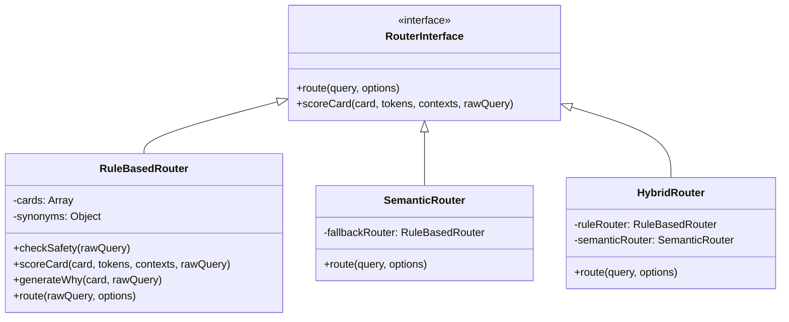

# 명심코칭 NO-AI Production Mode 운영 안내서
**문서 위치**: `/docs/no-ai-mode.md`  
**버전**: v1.0.0  
**관리 주체**: 마인드플로우 랩 코어 엔지니어링팀

---

## 1. 개요 (Overview)

명심코칭은 외부 LLM(OpenAI, Anthropic, Gemini 등)의 유료 API나 대규모 인프라 없이도, 클라이언트 브라우저와 정적 인덱스만으로 전체 사용자 경험(고민 입력 &rarr; 질문 카드 &rarr; SCAN &rarr; 10% 실천)이 100% 작동하도록 설계된 **NO-AI Production Core**를 기본 엔진으로 채택하고 있습니다.

이 문서는 운영진과 개발진이 외부 API 키 0개 상태에서 서비스를 안정적으로 운영하고, 향후 필요 시 AI 엔진을 플러그인 형태로 확장하는 방법을 안내합니다.

---

## 2. 기능 지원 현황

### ✅ 완벽하게 실구동되는 기능 (100% NO-AI)
1. **자연어 고민 라우터 (`RuleBasedRouter`)**:
   - 한국어 자모/조사 정규화 (`KoreanNormalizer`)
   - 28개 테마 동의어 사전 매핑 (`data/search/synonyms.json`)
   - 6대 컨텍스트 감지 (가족, 직장, 연애, 재정, 사주, 완벽주의)
   - 8개 태그 가중치 스코어링 공식
   - 상위 3개 관점 다양화 (Top 3 Diversification: Trigger / Story / Urge)
2. **사전 작성된 비진단 WHY 문구**:
   - 생성형 AI 없이 카드의 `matchReasons`에서 dominant signal을 조합하여 1~2문장으로 매칭 사유 노출.
3. **Safety Router (위기지원 직통)**:
   - 자해·자살·폭력 100% 차단 및 109 직통 안내 화면.
   - Near-miss 구어체 과잉 반응 방지 ("일 때문에 죽겠다" 정상 처리).
   - 전재산 투자/빚보증 등 고위험 재정 분기 안내.
4. **전체 코칭 여정 (SCAN &rarr; SYNC &rarr; SHIFT &rarr; 10% ACTION)**.
5. **관리자 CMS 및 Router Debugger**.
6. **Experience Intelligence 및 Content Gap 집계**.

### ⚠️ 현재 제한되거나 수동으로 운영되는 기능
- **Semantic Vector Embedding / Reranking**: 현재는 키워드+태그 앙상블로 동작.
- **AI 카피 자동 제안**: 운영자가 직접 CMS에서 작성 및 검수.
- **주관식 설문 자동 요약**: 정량 지표 통계로 집계.

---

## 3. 라우터 아키텍처 및 추상화 구조



- **현재 기본 설정**: `ROUTER_CONFIG.ROUTER_MODE = 'rule'` (Zero-API 실구동)
- **파일 위치**: [`/js/myeongsim-ai-router.js`](file:///c:/Users/aaccd/Downloads/마인드플로우랩홈페이지/js/myeongsim-ai-router.js)

---

## 4. 향후 AI API 연결 방법 (Hybrid Mode)

향후 외부 임베딩 모델(예: OpenAI `text-embedding-3-small` 등)을 도입하고자 할 때는 기존 200개 카드, CMS, 개인정보 4계층 구조를 전혀 수정할 필요가 없습니다.

1. **설정 변경**:
   ```javascript
   // js/myeongsim-ai-router.js
   const ROUTER_CONFIG = {
     ROUTER_MODE: 'hybrid', // 'rule'에서 'hybrid'로 전환
     ...
   };
   ```
2. **동작 방식**:
   - `HybridRouter`가 룰 기반 후보군과 시맨틱 임베딩 후보군을 각각 도출한 뒤 병합 및 재순위화(Reranking).
   - 만약 AI API 네트워크 타임아웃, 할당량 초과(Quota Exceeded), 공급자 장애 발생 시 **즉시 `RuleBasedRouter`로 무중단 자동 폴백**되어 사용자 화면은 0.1초도 멈추지 않습니다.
3. **Safety 독립성 유지**:
   - Safety Router는 AI 유무와 무관하게 항상 최우선 독립 룰 레이어로 작동하여 절대 뚫리지 않습니다.
