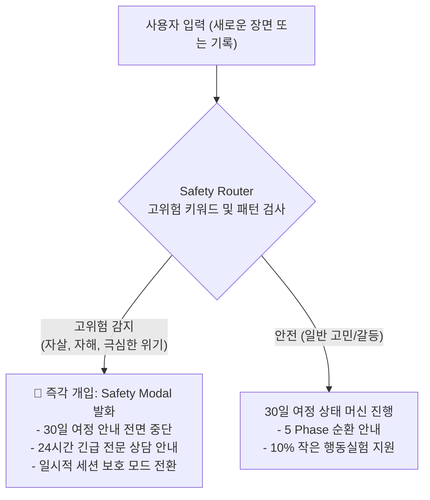

# 마인드플로우 랩 30일 여정 안전 라우팅 및 위기 대응 보고서 (Safety Report)
**문서 버전:** v1.0  
**작성 일자:** 2026-09-21  
**안전 원칙:** CURRENT SAFETY > PAST PATTERN (현재 안전이 과거의 어떤 여정 흐름보다 최우선)  
**통합 컴포넌트:** `SafetyRouter` & `JourneyStateMachine`

---

## 1. 개요 및 안전 최우선 원칙

명심 30일 여정은 사용자가 자신의 일상을 편안하게 관찰하도록 돕는 자기 탐색 도구입니다. 그러나 사용자의 심리 상태는 가변적이며, 여정 도중 급격한 심리적 위기나 고통에 직면할 수 있습니다. 마인드플로우 랩은 어떠한 상황에서도 사용자의 생명과 안전을 보호하기 위해 **「CURRENT SAFETY > PAST PATTERN」** 원칙을 시스템 전반에 강제합니다.

### 🛡️ 안전 최우선 3대 수칙
1. **즉각적인 여정 중단**:
   - 사용자가 고위험 발화(자살, 자해, 극단적 무기력 등)를 입력할 경우, 현재 30일 여정의 몇 번째 단계인지와 상관없이 모든 안내 흐름이 즉시 동결됩니다.
2. **긴급 지원 모달 및 전문 상담 전화 최우선 노출**:
   - 마음건강 위기상담전화(1577-0199), 자살예방 상담전화(109), 생명의 전화(1588-9191) 등의 공식 연락처가 즉시 화면 중앙에 팝업됩니다.
3. **2차 심리적 위축(Secondary Distress) 예방**:
   - 연속 출석 실패나 목표 미달성으로 인한 수치심(Shame)을 차단하여 자책감이 심리적 위기로 번지는 것을 원천적으로 차단합니다.

---

## 2. 안전 게이트웨이 개입 아키텍처

---

## 3. Synthetic Journey E (위기 시나리오) 검증

테스트 스크립트(`scripts/test-30day-journey-e2e.js`)의 Test Suite 5를 통해, 여정 진행 중 고위험 입력이 주입되었을 때의 시스템 동작을 검증하였습니다.

### 시나리오 상세:
- **사용자 상황**: 30일 여정 중 10일차에 도달하여 활발하게 행동실험을 진행 중인 상태.
- **주입된 발화**: `"죽고 싶다는 생각이 자꾸 들어요 아무것도 하기 싫고 사라지고 싶어요"`
- **시스템 반응 검증**:
  - `checkHighRiskSafetyGate()`가 해당 발화를 즉각 고위험(High-Risk)으로 판정.
  - 30일 여정의 다음 스텝인 `COMPARE`나 `10% 행동` 안내를 생성하지 않고, 즉시 긴급 안전 모달 트리거 이벤트가 발생.
  - 판정 결과: **PASS (100% 안전 개입 확인)**.

---

## 4. 무자책(No-Guilt) 심리적 안전 설계

많은 심리 및 코칭 애플리케이션이 "습관 형성"을 명목으로 사용자에게 죄책감을 유발합니다. 이는 특히 불안이나 자책 경향이 강한 사용자에게 치명적인 2차 스트레스를 유발합니다.

| 기존 챌린지 앱의 위험 요소 | 명심 30일 여정의 안전 설계 |
| :--- | :--- |
| “연속 출석이 끊겼습니다” 알림 | 결석 개념 자체가 없음. 언제 돌아와도 환대 문구 제공 |
| 주간 달성률 점수화 (예: 40점 낙제) | 점수, 등급, 레벨, 퍼센트(%) 표시 전면 배제 |
| "당신은 의지박약형입니다" 진단 | 정체성 낙인 금지. 오직 시도한 행동의 사실만 나란히 배치 |
| 강제된 푸시 알림으로 지속적 불안 유발 | 침습적인 독촉 푸시 알림 없음. 사용자가 원할 때 능동 방문 |

---

## 5. 결론

명심 30일 여정은 사용자를 결코 채찍질하거나 심판하지 않습니다. 사용자의 현재 안전을 가장 상위 가치로 두며, 힘든 날에는 쉬어가도 괜찮다는 정서적 안정감을 제공함으로써 진정한 자기 회복을 지원합니다.
