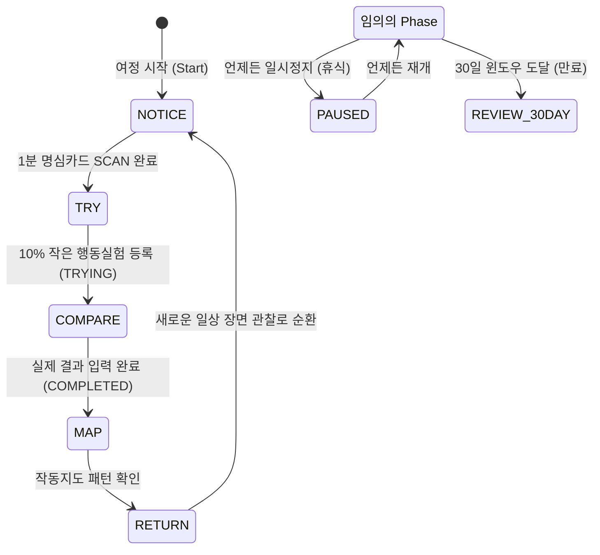

# 마인드플로우 랩 30일 여정 상태 머신 분석 보고서 (State Machine Report)
**문서 버전:** v1.0  
**작성 일자:** 2026-09-21  
**엔진 파일:** `js/myungsim-30day-journey.js`  
**상태 엔진:** `JourneyStateMachine`

---

## 1. 개요

`JourneyStateMachine`은 외부 AI의 불확실한 환각이나 API 응답 지연 없이, 순수한 결정론적(Deterministic) 로직에 의해 구동되는 클라이언트 사이드 상태 머신입니다. 사용자의 세션 누적 수, 행동실험 진행 상태, 시간 경과 정보를 입력받아 다음 최적의 한 걸음(`nextStep`)과 안내 문구(`actionPrompt`)를 산출합니다.

---

## 2. 5대 Phase 순환 정의 및 라이프사이클

| Phase | 명칭 | 주 행동 | 전환 트리거 | 사용자 관점의 의미 |
| :--- | :--- | :--- | :--- | :--- |
| **NOTICE** | 장면 자각 | 지금 마음에 걸리는 한 장면 바라보기 | 1분 명심카드 SCAN 완료 시 | 반응을 멈추고 현상을 있는 그대로 자각함 |
| **TRY** | 10% 시도 | 부담 없는 작은 다른 선택 하나 품기 | 10% 행동실험 카드 생성 시 | 크게 바꾸지 않고 10%만 가볍게 시도함 |
| **COMPARE**| 예상/실제 | 머릿속 예상과 실제 일어난 일 비교 | 실제 결과(Actual Result) 기록 시 | 두려웠던 예상과 현실의 차이를 확인하여 뇌를 재학습함 |
| **MAP** | 작동지도 | 최근 반복된 자동 반응 패턴 살펴보기 | 작동지도 페이지 확인 시 | 내 무의식적 패턴이 어떻게 작동하는지 전체 맥락을 봄 |
| **RETURN** | 삶으로 복귀 | 배운 것을 안고 가볍게 일상으로 돌아가기 | "오늘은 끝내기" 버튼 클릭 시 | 앱에 머물지 않고 일상의 삶으로 건강하게 복귀함 |

---

## 3. 상태 전이 결정 규칙표 (Decision Table)

| 조건 번호 | 상태 조건 (Condition) | 산출 Phase | nextStep | actionPrompt (사용자 안내 문구) |
| :--- | :--- | :--- | :--- | :--- |
| **C-01** | 여정이 없거나 NOT_STARTED | `NOTICE` | `OFFER_START` | “30일 동안 내 작동을 가볍게 관찰해볼까요?” |
| **C-02** | 여정 상태가 `PAUSED` | 현재 Phase 유지 | `RESUME_OR_PAUSE` | “잠시 멈춰둔 여정입니다. 준비되셨을 때 언제든 이어가실 수 있습니다.” |
| **C-03** | `now >= windowEndAt` (30일 경과) | `RETURN` | `REVIEW_30DAY` | “30일 관찰 기간이 지났습니다. 지난 경험의 흐름을 가볍게 돌아봅니다.” |
| **C-04** | 진행 중인 행동실험 존재 (`TRYING` / `PLANNED`) | `COMPARE` | `WAIT_OR_FOLLOWUP`| “지난번 선택: 실제로 무슨 일이 일어났는지 확인해볼 차례입니다.” |
| **C-05** | 세션 3개 이상 & 완료된 실험 1개 이상 | `MAP` | `MAP` | “최근 기록에서 반복해서 나타난 흐름이 있을까요? 작동지도를 살펴봅니다.” |
| **C-06** | 완료된 실험 1개 이상 존재 | `RETURN` | `MAP` | “하나의 실험을 마쳤습니다. 다음 삶의 장면으로 가볍게 돌아가거나 지도를 봅니다.” |
| **C-07** | 최근 SCAN 기록만 존재 (실험 미생성) | `TRY` | `TRY` | “다음에 비슷한 장면이 오면 10% 다르게 해볼 행동을 품어봅니다.” |
| **C-08** | 초기 상태 (아무 기록 없음) | `NOTICE` | `START_SCENE` | “오늘 마음에 걸리는 한 장면을 1분 동안 있는 그대로 관찰합니다.” |

---

## 4. No-Streak & No-Score 무결성 검증

전통적인 앱은 사용자가 N일 동안 미접속할 경우 다음과 같은 부정적 피드백을 제공하여 이탈을 유발합니다:
- “연속 3일 출석이 끊어졌습니다!”
- “이번 주 달성률 20% (미흡)”
- “놓친 14일차 미션을 지금 수행하세요.”

### 30-Day Journey의 안티-죄책감(No-Guilt) 설계:
1. **결석 개념의 부재**: 스토리지에는 사용자의 출석 체크인 카운터 자체가 존재하지 않습니다. 오직 `startedAt`과 `windowEndAt`이라는 **30일의 시간적 그릇(Window)**만 보관됩니다.
2. **장기 미접속(예: 15일 후) 재방문 시 동작**:
   - `StateMachine.evaluate`는 미접속 일수를 계산하지 않습니다.
   - 단지 남은 일수(`daysRemaining: 15`)와 현재 사용자가 멈춰있던 Phase(예: `NOTICE`)에서 즉시 편안하게 시작하도록 환대합니다.
   - E2E 검증 결과: 프롬프트에 `결석`, `놓쳤`, `스트릭`, `오랜만` 등의 단어가 0건 검출되었습니다.

---

## 5. Time Travel 시뮬레이션 테스트 결과

테스트 스크립트(`scripts/test-30day-journey-e2e.js`)를 통해 모의 시계(`testMockDate`)를 주입하여 시간 이동 시의 상태 머신 안정성을 검증하였습니다.

| Time Point | 모의 날짜 | 잔여 일수 | isWindowExpired | 결과 상태 | 판정 |
| :--- | :--- | :--- | :--- | :--- | :--- |
| **T+0** | 2026-09-01 (시작일) | 30일 | `false` | `ACTIVE` (정상 구동) | **PASS** |
| **T+1** | 2026-09-02 (1일차) | 29일 | `false` | `ACTIVE` (정상 구동) | **PASS** |
| **T+15**| 2026-09-16 (15일차) | 15일 | `false` | `ACTIVE` (결석 0건, 정상 안내) | **PASS** |
| **T+30**| 2026-10-01 (만료 정각) | 0일 | `true` | `COMPLETED` (`REVIEW_30DAY`) | **PASS** |
| **T+45**| 2026-10-16 (만료 15일 후)| 0일 | `true` | `COMPLETED` (`REVIEW_30DAY`) | **PASS** |

---

## 6. 결론

`JourneyStateMachine`은 외부 의존성이 전혀 없는 독립형 JavaScript 객체로서, 네트워크 단절이나 API 키 오류 상황에서도 100% 정상 작동하며 사용자에게 일관되고 따뜻한 자율 속도의 여정을 제공합니다.
