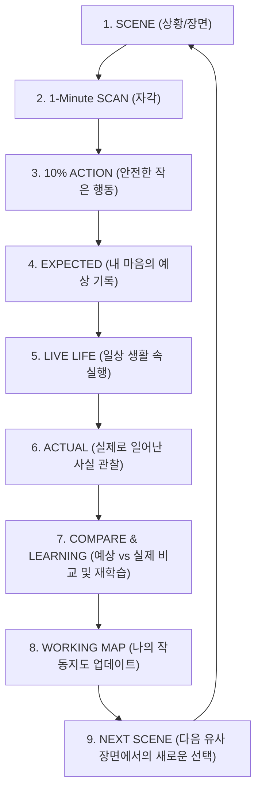

# 명심코칭 행동실험 루프 v1 시스템 아키텍처 보고서
(MYUNGSIM BEHAVIOR EXPERIMENT LOOP v1 ARCHITECTURE REPORT)

> **핵심 선언:**  
> “생각만 바꾸는 것이 아니라, 작은 행동으로 실제 결과를 확인합니다.”  
> 명심코칭은 사용자를 평가하거나 점수 매기는 시스템이 아니라, **작은 행동실험(10% Action)을 통해 내 예상(Expected)과 실제(Actual)를 비교하고 선택 공간을 넓히는 시스템**입니다.

---

## 1. 아키텍처 개요 및 반복 루프 구조

명심코칭의 행동변화는 '좋은 생각'을 읽고 끝나는 것이 아니라, 삶의 현장에서 다음 6단계의 순환 루프로 작동합니다.

---

## 2. 도메인 데이터 모델 사양

각 행동실험(`MyungsimBehaviorExperiment`)은 다음과 같은 표준 사양으로 클라이언트 로컬 환경에 격리 보관됩니다.

| 필드명 | 데이터 타입 | 설명 및 유효값 |
| :--- | :--- | :--- |
| `experimentId` | String | 고유 식별자 (`exp_{timestamp}_{hash}`) |
| `userId` | String | 로컬 익명 식별자 (`anon_{hash}`) |
| `sourceCardId` | String | 연계된 명심카드 ID (예: `perfectionism-10`, `overchecking-01`) |
| `sourceSessionId` | String / Null | 1분 SCAN 세션 연계 ID |
| `createdAt` | ISO-8601 String | 실험 생성 일시 |
| `scene` | String | 촉발된 현실 상황/장면 |
| `directionCheck` | Enum | 10초 방향 점검 (`boundary`, `understand`, `solve`, `info`, `relationship`, `rest`, `win`) |
| `expectedResult` | String | 행동 전 내 마음의 예상 1문장 ("이 행동을 하면 무슨 일이 생길 것 같나요?") |
| `confidence` | Enum | 확신 느낌 강도 (`strong`, `possible`, `unknown`) — **확률 숫자 점수화 금지** |
| `selectedAction` | String | 선택된 10% 실행 행동 (기존 카드 및 Action Ladder 기반) |
| `smallerAction` | String | 부담을 낮춘 5% 또는 1% 깃털 행동 |
| `actionSizeCheck` | Enum | 행동 크기 점검 (`manageable` [해볼 만해요] / `too_big` [조금 커요]) |
| `actionType` | Enum | 마이크로 액션 타입 (`DELAY`, `ASK`, `CHECK_FACT`, `BOUNDARY`, `ONE_SMALL_STEP` 등) |
| `controlCircle` | Enum | 통제 원환 (`self`, `cooperate`, `other`, `uncontrollable`) |
| `status` | Enum | `PLANNED` (대기), `DONE` (완료), `PARTIAL` (부분완료), `NOT_DONE` (미실행), `CANCELLED` (상황없음/닫힘) |

### 팔로업(Follow-up) 데이터 필드
- `followup.openedAt`: 팔로업 화면 오픈 시점
- `followup.executionStatus`: 실행 여부 (`done`, `partial`, `not_done`, `no_situation`)
- `followup.notDoneReason`: 미실행 원인 (`anxiety_too_big`, `action_too_big`, `situation_changed`, `forgot`, `mind_changed`)
- `followup.actualResult`: 실제로 일어난 일 (**해석 배제, FACT 중심 기록**)
- `followup.comparison`: 예상과 실제 비교 (`almost_same`, `slightly_different`, `very_different`, `hard_to_judge`)
- `followup.wasResponsePossible`: 예상이 맞았을 때 대응 가능 여부 ("그 일이 일어났을 때 나는 대응할 수 있었나요?")
- `followup.learning`: 새로 알게 된 점 ("배운 게 없음" 선택권 보장)
- `followup.nextChoice`: 다음 선택 (`same_again`, `smaller`, `bigger`, `different`, `undecided`)

---

## 3. 핵심 설계 원칙 및 철학

1. **NO-AI Production Core**:
   - 외부 LLM/AI 호출 0건(Zero-Key). 템플릿과 정형화된 선택지, 사용자 입력으로 100% 신뢰성 있게 구동.
2. **NO-SHAME & NO-STREAK**:
   - 연속 행동일(Streak), 성공률/실패율, 0점 처리를 일체 배제.
   - 행동하지 못한 것(`NOT_DONE`) 또한 내 마음과 행동의 크기를 자각하는 **유효하고 소중한 데이터**로 존중.
3. **PREVENTION → RESPONSE 패러다임 전환**:
   - "나쁜 일이 절대 일어나지 않게 예방해야 한다"에서 "나쁜 일이 일어나더라도 나는 어떻게 대응할 것인가"로 확장.
4. **REASSURANCE LOOP 방지 가드**:
   - 카드를 계속해서 조회하는 행동 패턴(3회 이상 탐색) 감지 시, 새로운 질문을 더 찾기보다 지난 선택의 실제 결과를 확인하도록 부드럽게 안내.
5. **동시 활성 실험 제한**:
   - 사용자에게 과제가 쌓이지 않도록 활성 실험은 기본 1개(최대 2개)로 엄격히 통제하며, 오래된 실험은 Auto Close 지원.
