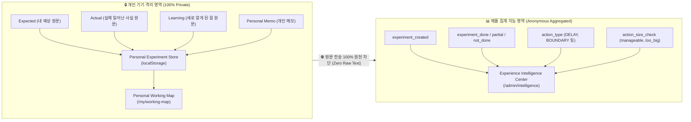

# 명심코칭 행동실험 프라이버시 아키텍처 및 원문 분리 감사 보고서
(MYUNGSIM BEHAVIOR EXPERIMENT PRIVACY & RAW-TEXT ISOLATION AUDIT)

> **데이터 헌장 핵심 원칙:**  
> “명심코칭의 시스템은 사람을 더 많이 캐내는 시스템이 아니라, 사람을 덜 침해하면서 제품을 더 잘 만드는 시스템입니다.”

---

## 1. 개인 데이터와 제품 분석 데이터의 엄격한 분리 구조

행동실험에서 사용자가 직접 작성하거나 선택한 주관적 원문은 **100% 사용자의 기기(로컬 브라우저)** 내에만 보관되며, 서버나 외부 분석 도구로 일절 전송되지 않습니다.

---

## 2. 데이터 전송 화이트리스트 및 차단 감사 결과

### 2-1. 허용된 분석 이벤트 (Whitelisted Events)
`trackSafeExperimentEvent` 함수를 통해 다음 9개 이벤트만 발행됩니다:
1. `experiment_created`: 실험 생성 시점
2. `experiment_action_selected`: 10% 행동 또는 축소 행동 선택 시점
3. `experiment_followup_opened`: 팔로업 모달 오픈 시점
4. `experiment_done`: 실행 완료 기록 시점
5. `experiment_partial`: 일부 실행 기록 시점
6. `experiment_not_done`: 미실행 기록 시점 (원인 카테고리만 집계)
7. `experiment_actual_recorded`: 사실 기록 완료 시점
8. `experiment_learning_recorded`: 재학습 완료 시점
9. `experiment_next_choice_selected`: 다음 선택 확정 시점

### 2-2. 허용된 익명 메타데이터 (Whitelisted Metadata)
- `experimentId`: 익명 난수 ID
- `cardId`: 명심카드 ID (예: `overchecking-01`)
- `category`: 고민 카테고리 (예: `불확실성`)
- `actionType`: 마이크로 액션 분류 (예: `DELAY`, `BOUNDARY`)
- `status`: 완료 상태 (`DONE`, `NOT_DONE` 등)
- `actionSize`: 크기 조율 신호 (`10%`, `smaller`)
- `comparison`: 단순 범주 (`almost_same`, `slightly_different`)

### 2-3. 원천 차단 필드 (Blacklisted & Stripped Fields)
- `expectedResult`: **전송 차단 (0건)**
- `actualResult`: **전송 차단 (0건)**
- `learning`: **전송 차단 (0건)**
- `personalMemo`: **전송 차단 (0건)**
- `whatHappened`: **전송 차단 (0건)**
- `query` (사용자 원문 검색어): **전송 차단 (0건)**

---

## 3. 관리자 CMS (Admin) 프라이버시 격리

관리자 화면(`/admin/intelligence.html`)에서는:
- **조회 가능:** 총 실험 수, 팔로업 기록률, 미실행 비율, 주요 Action Type 분포, Action Too Big 비율 및 Action Review Candidates (카드 ID 단위).
- **조회 불가능:** 개별 사용자의 예상 원문, 실제 일어난 일의 내용, 학습 메모 등 일체의 텍스트.

---

## 4. 사용자 권리 보장: 완전 삭제(Delete) 및 닫기(Close)

- 사용자는 `/my/experiments.html`에서 언제든 자신의 실험을 삭제하거나 닫을 수 있습니다.
- 실험 삭제 시 로컬 저장소에서 즉시 영구 삭제되며, 작동지도(Working Map) 재계산에서도 완벽하게 제외됩니다.
- 개인 실험 페이지는 `noindex, nofollow, noarchive` 메타 태그가 적용되어 검색엔진 및 외부 크롤러로부터 철저히 보호됩니다.
