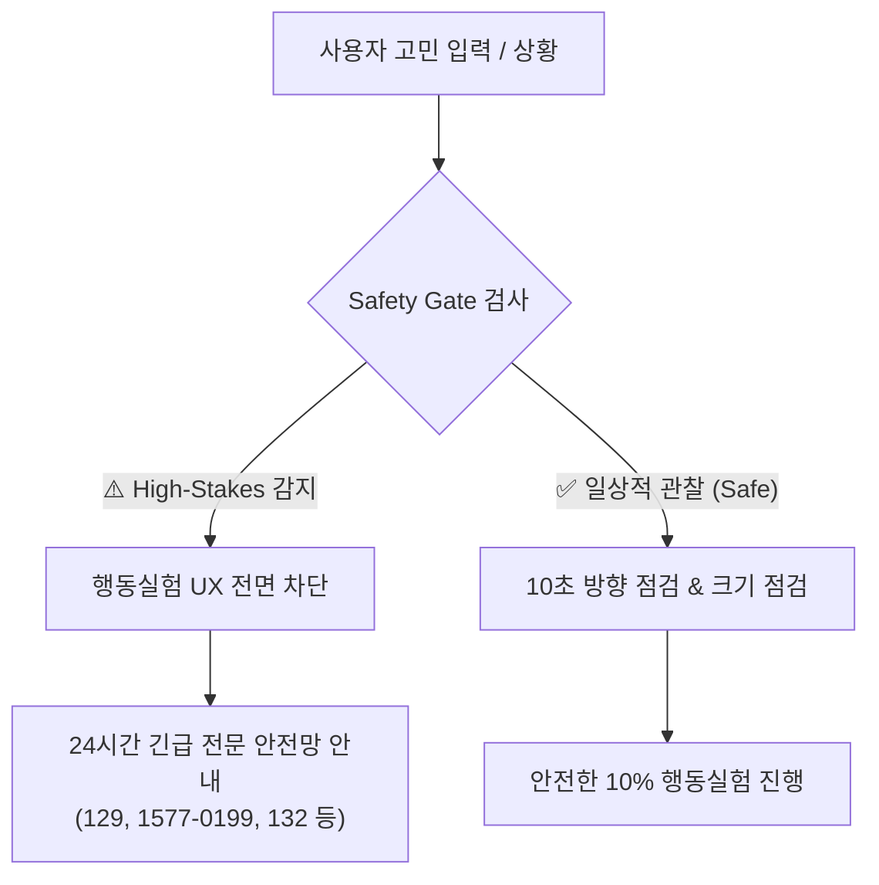

# 명심코칭 행동실험 안전 게이트 및 위기 배제 보고서
(MYUNGSIM BEHAVIOR EXPERIMENT SAFETY GATE & HIGH-STAKES EXCLUSION REPORT)

> **안전 제1원칙:**  
> “고위험 순간에는 행동실험을 하지 않습니다. 안전과 현실적 전문 판단이 절대적으로 우선합니다.”

---

## 1. High-Stakes 배제 원칙 및 영역 규정

명심코칭의 행동실험(Behavior Experiment)은 **안전하고, 작고, 되돌릴 수 있는 일상의 10% 선택**에만 적용됩니다.  
다음과 같은 고위험(High-Stakes) 영역에서는 일반 행동실험 UX를 전면 차단하고, 전문 안전망 및 기관 연결을 최우선으로 제공합니다:

1. **자해 및 자살 위기**: 자해, 자살 암시, 극단적 선택 언급
2. **타인 위해 및 폭력**: 가정폭력, 신체적 상해, 폭행, 감금, 협박
3. **스토킹 및 성폭력**: 스토킹, 성폭행, 성추행, 성적 강압
4. **고위험 재무 및 투자**: 전재산 투자, 빚보증, 사채/대출 영끌 투기, 파산/개인회생 위기
5. **의료 및 정신과 약물 고위험**: 정신과 처방약 임의 중단, 약물 과다 복용
6. **고위험 전문 법률 분쟁**: 형사소송, 이혼소송, 고소장 제출 등

---

## 2. 안전 게이트(Safety Gate) 작동 메커니즘

1-Minute SCAN 진입 시 및 10% 행동실험 모달 생성 시(`openCreateModal`), 사용자의 입력 문맥과 고민 상황을 사전 검사합니다.

---

## 3. 운세/예언 질의와의 철저한 구분

행동실험은 “오늘 운세가 맞는지 검증해보자”는 식의 게임이 아닙니다.
- **운세 검증 게임 금지**: 운세의 적중 여부를 시험하는 것이 아닙니다.
- **목적의 차별화**: “특정 믿음이나 불안이 있을 때, 내 선택과 행동이 어떻게 달라지는가?”를 스스로 관찰하고 일상의 통제권을 회복하는 것이 유일한 목적입니다.

---

## 4. E2E 안전 테스트 검증 완료

자동화 테스트(`scripts/test-behavior-experiment-e2e.js`)를 통해 다음 3대 시나리오를 100% 검증했습니다:
- 자해/자살 쿼리 입력 시: 즉각 차단 및 안전망 모달 팝업 확인 (PASS)
- 전재산/빚보증 몰빵 쿼리 입력 시: 재무 고위험 안전망 전환 확인 (PASS)
- 일상적 답장 지연/경계 설정 쿼리: 안전하게 10% 행동실험 생성 (PASS)
