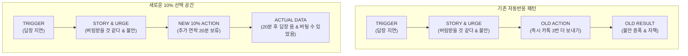

# 명심코칭 행동실험과 개인 작동지도 연동 보고서
(MYUNGSIM BEHAVIOR EXPERIMENT & PERSONAL WORKING MAP INTEGRATION REPORT)

> **작동지도 변화 표현 원칙:**  
> “최근 기록에서는 기존 행동 외에 다른 선택도 나타나기 시작했습니다.”  
> *(금지: ‘신경회로가 40% 변화했습니다’, ‘뇌가 재배선되고 있습니다’, ‘점수가 43점 상승했습니다’)*

---

## 1. 작동지도(Personal Working Map) 연결 파이프라인

행동실험에서 얻은 실제 경험 데이터는 `/my/working-map.html`을 통해 개인의 자각 파이프라인으로 시각화됩니다.

---

## 2. 변화 표현의 엄격한 가이드라인 준수

1. **뇌과학/의학적 과장 배제**:
   - Neural Code라는 제품명/도서 개념을 활용하되, 실제 뇌 변화가 측정되었다거나 신경망이 물리적으로 재배선되었다는 식의 과학적 과장 표현을 일체 사용하지 않습니다.
2. **수치화 및 점수제 배제**:
   - “패턴 개선도 82%”, “완벽주의 지수 40점 감소”와 같은 인위적 수치를 배제하고, 사실과 경험의 누적으로만 표현합니다.
3. **존중과 인정의 언어**:
   - “최근에는 예상과 실제를 비교하는 기록이 늘었고, 바로 반응하기보다 잠시 보류하는 선택도 나타났습니다.”와 같이 사용자 자신의 경험에 기반한 차분한 사실적 기술을 유지합니다.

---

## 3. 다회차 누적 실험 시뮬레이션 검증 (E2E)

동일한 트리거(답장 지연 또는 거절 순간)에서 3회 이상 행동실험이 누적되었을 때:
- 1회차: 예상(크게 화냄) &rarr; 행동(거절) &rarr; 실제(서운함 표현)
- 2회차: 예상(또 화냄) &rarr; 행동(확인 후 답변) &rarr; 실제(대화 지속)
- 3회차: 예상(어색해짐) &rarr; 행동(20분 보류) &rarr; 실제(답장 도착)

이 모든 흐름이 `/my/experiments.html`의 타임라인 뷰와 `/my/working-map.html`의 선택 분기에 매끄럽게 연결되며, 사용자가 특정 실험을 삭제하면 작동지도에서도 즉시 안전하게 제외 및 재계산됨을 검증 완료했습니다.
