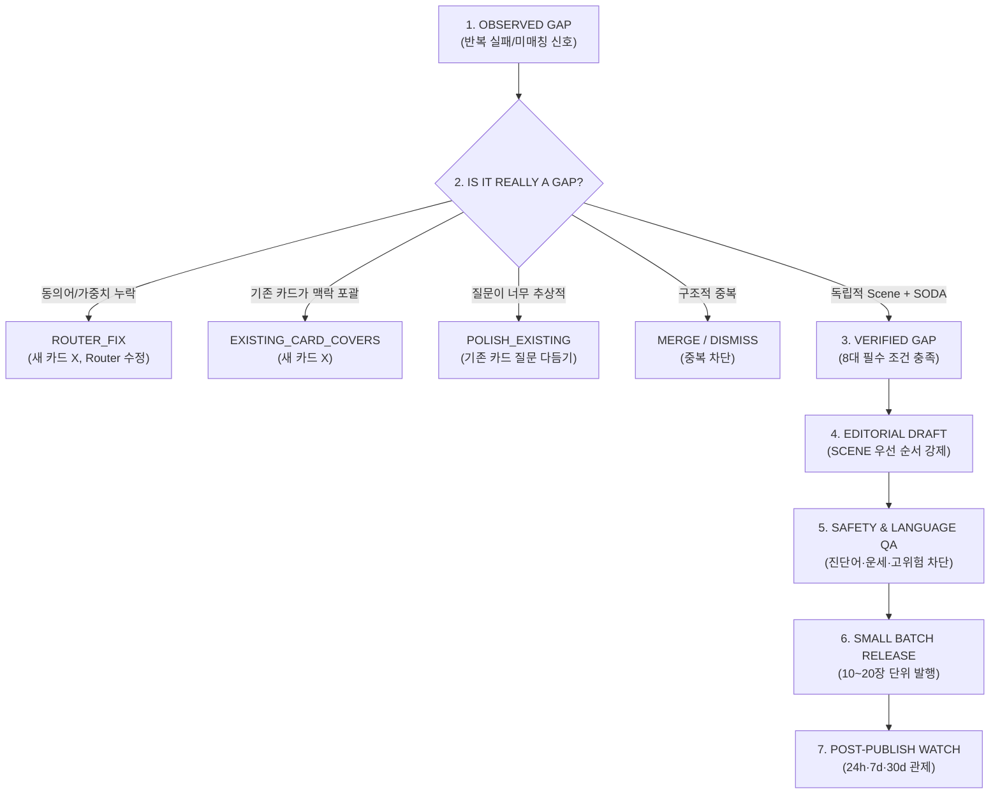

# MYUNGSIM Evidence-Based Content Expansion Architecture Report

## 1. 개요 및 확장 철학 (Philosophy)
- **문서 버전**: v1.0.0
- **핵심 명제**: **`CONTENT COUNT ≠ PRODUCT QUALITY` (카드 수량이 프로덕트의 품질을 결정하지 않는다)**
- **기본 방침**: 300장을 채우는 것이 프로젝트의 목표가 아니며, 30일 실제 런칭 데이터에서 입증된 Verified Gap이 18개뿐이라면 218장에서도 확장을 멈추는 엄격한 절제력을 유지합니다.

---

## 2. 확장 파이프라인 공식 (The Expansion Formula)

---

## 3. 핵심 아키텍처 규칙

### 1) 개인 사연 복사 금지 (Generalized Situation)
- 사용자의 사적인 고민 원문(Private Raw Story)을 그대로 카드 질문으로 복사하는 것을 절대 금지합니다.
- 반드시 일상에서 보편적으로 관찰 가능한 **일반화된 상황(Generalized Situation)**으로 전환합니다.

### 2) 순서 강제 원칙 (SCENE-First Editorial Flow)
- 카드 가제(Title)부터 짓지 않습니다.
- **SCENE(장면) → QUESTION(질문) → MECHANISM(기제) → SODA(관점전환) → SCAN(관찰) → ACTION(10%행동) → TITLE(가제)** 순서를 강제합니다.

### 3) 250장 체크포인트 및 팽창 일시정지 (Expansion Pause)
- 250장에 도달하면 300장으로 자동 진행하지 않고 Router 혼선, 중복률을 전수 감사(Audit)합니다.
- Golden Test 회귀(Regression) 발생 시 배치가 즉시 중단(Block)됩니다.
