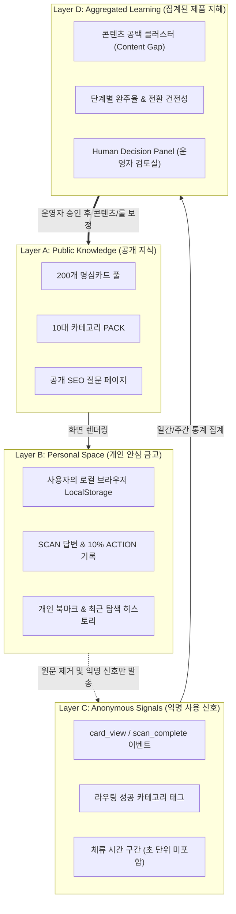

# 명심코칭 Experience Intelligence 아키텍처 및 철학 선언서
**문서 버전**: v1.0.0  
**최종 갱신일**: 2026-09-19  
**상태**: 정식 승인 (Approved)  
**관리 주체**: 마인드플로우랩 프로덕트 & 프라이버시 위원회

---

## 1. 핵심 철학 선언 (Core Philosophy)

> **"명심코칭의 Experience Intelligence는 사람을 더 많이 알아내는 시스템이 아니라, 사람을 덜 침해하면서 제품을 더 잘 만드는 시스템입니다."**

대다수의 현대 디지털 서비스는 사용자의 사생활, 감정, 은밀한 검색어를 수집하고 프로파일링하여 타깃 광고나 인위적인 체류 시간 연장을 유도합니다.  
하지만 **명심코칭은 사람의 고통과 불안, 내면의 비밀을 먹고 자라지 않습니다.**  
우리는 사용자의 원문 고백(Raw Query/Emotion Text)을 절대 서버에 전송하거나 저장하지 않으며, 단지 **"어떤 질문 카드가 사람들에게 명료한 행동(10% Action)을 이끌어냈는가?"**, **"어떤 영역의 지혜가 아직 부족하여 사람들의 걸음을 멈추게 했는가?"**와 같은 **'제품 사용 경험의 비식별 신호(Experience Signals)'**만을 조심스럽게 관찰하고 학습합니다.

---

## 2. 패러다임 비교: 감시(Surveillance) vs 학습(Product Learning)

| 구분 | 일반적인 감시형 분석 (User Surveillance) | 명심코칭 경험 지능 (Product Learning) |
| :--- | :--- | :--- |
| **수집 대상** | 사용자가 입력한 구체적 고민 문장, 감정 고백 원문 | 익명화된 카드 ID, 카테고리 태그, 프로세스 단계 도달 여부 |
| **식별 방식** | 쿠키, 기기 지문(Fingerprint), 개인 식별자(UID) 영구 추적 | 임의 세션 토큰, 로컬 저장소 기반 독립 실행 (서버 식별자 없음) |
| **목적** | 개인 타깃팅, 체류 시간 극대화, 데이터 상업적 판매 | 카드의 유효성 검증, 콘텐츠 공백(Content Gap) 발견, 경험 개선 |
| **데이터 보관** | 중앙 데이터베이스 영구 적재 | 원문 미전송(Zero Raw Text), 집계 통계만 30일 단위 롤링 분석 |
| **운영 방식** | 알고리즘이 사용자 몰래 화면과 추천을 임의 조작 | 사람(운영자)이 집계 통계를 보고 승인하여 카드와 룰을 갱신 (Human-in-the-Loop) |

---

## 3. 데이터 4계층 아키텍처 (The 4-Layer Privacy Model)

명심코칭 시스템의 모든 데이터 흐름은 다음 4개의 층으로 엄격하게 격리됩니다:

### 계층별 상세 설명

1. **Layer A — Public Knowledge (공개 지식 계층)**
   - 누구나 열람할 수 있는 10개 팩, 200장의 명심카드, 공개 질문 페이지, 추천 가이드라인입니다.
   - 모든 사용자에게 동일하고 투명하게 제공되며, 어떠한 개인화 추적도 포함되지 않습니다.

2. **Layer B — Personal Space (개인 안심 금고 계층)**
   - 사용자가 작성한 SCAN 성찰 글, 체크한 10% 액션 완료 여부, 즐겨찾기 목록이 머무는 공간입니다.
   - **오직 사용자의 기기(브라우저 LocalStorage)에만 암호화/저장**되며, 마인드플로우랩의 서버나 외부 네트워크로 절대 1바이트도 전송되지 않습니다.

3. **Layer C — Anonymous Signals (익명 신호 계층)**
   - 서비스가 올바르게 작동하는지 확인하기 위해 전송되는 최소한의 이벤트입니다.
   - 예: `cardId: "C-042"`, `step: "sync_reached"`, `category: "boundary"`
   - **철저한 금지 항목**: 사용자 IP 마스킹, 사용자 입력 텍스트(Query Text) 전송 차단, 디바이스 식별자 미발급.

4. **Layer D — Aggregated Learning (집계된 지능 계층)**
   - 익명 신호들을 모아 운영자에게 "어떤 카드가 10% 실천 완료율이 높은가?", "어떤 질문 유형에서 응답을 찾지 못하고 뒤로 가는가?"를 알려주는 통계 대시보드입니다.
   - 이 계층의 정보는 `/admin/intelligence.html`에 시각화되며, 운영자의 제품 개선 의사결정을 돕는 데에만 쓰입니다.

---

## 4. 무결성 보장 메커니즘 (Zero Raw Text & Privacy Shield)

1. **원문 유출 0건 (Zero Raw Text Verification)**
   - 검색창 및 AI 고민 입력창에 사용자가 어떤 단어나 문장을 넣더라도, 전송 페이로드에는 해당 문자열이 포함되지 않습니다.
   - 브라우저 내부에서 키워드 추출 또는 카테고리 매핑(Client-side Router)만 수행된 뒤, 매핑된 카테고리 ID(`CAT-03`)와 추천 카드 번호(`C-018`)만이 전송됩니다.
2. **단방향 비가역성 (Irreversibility)**
   - 집계된 데이터(Layer D)로부터 개별 사용자의 행동이나 원문 고민을 역추적하는 것은 수학적·구조적으로 불가능합니다.
3. **인간 승인 루프 (Human-in-the-Loop Governance)**
   - AI나 자동화 스크립트가 임의로 카드의 문구를 바꾸거나 추천 가중치를 실시간으로 자율 변경하지 못하도록 잠금 장치가 적용되어 있습니다.
   - 모든 수정은 오직 사람이 리포트와 통계를 확인한 후 CMS에서 직접 승인(Publish)할 때만 배포됩니다.

---

## 5. 결론 및 보증

마인드플로우랩은 본 아키텍처 문서를 통해 사용자의 온전한 내면적 안전을 보증하며, 기술이 사람의 약점을 이용하는 것이 아니라 사람이 자기 삶의 주도권을 되찾도록 돕는 도구로 기능하도록 엄격한 프라이버시 거버넌스를 유지합니다.
