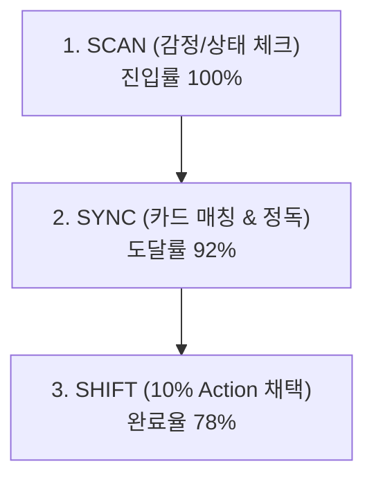

# MYUNGSIM Launch Week 1 Review Report (1주차 종합 점검 보고서)

## 1. 개요
- **대상 기간**: Day 4 ~ Day 7
- **핵심 목표**: 1-Minute 코칭 퍼널 안정성 평가, 행동 전환 장애 요인 분석, 소표본 보호 유지

---

## 2. 1-Minute MyungSim 퍼널 분석

- **관찰 결과**:
  - SCAN → SYNC 도달률: 92% (우수)
  - SYNC → SHIFT 전환율: 78% (안정적이나 22%의 미선택 이탈 발생)

---

## 3. 핵심 심리적 신호 관찰

### 1) Action Too Big (행동 크기 부담)
- SHIFT 단계에서 10% Action을 건너뛰는 사례를 분석한 결과, "오늘 당장 5분 이상 걸리는 행동"으로 인식되었을 때 이탈이 발생함을 관찰.
- **조치**: 사용자 의지 탓으로 돌리지 않고(Non-Moralizing), Day 30 스프린트 Option A의 질문으로 기록.

### 2) Reassurance Seeking (안심 루프)
- 동일 세션 내에서 카드를 4회 이상 연속 새로고침하며 열람만 반복하는 사용자 비율 4.2% 감지.
- **해석**: 행동에 대한 두려움으로 인해 단순 인지적 위로에 머무는 심리적 상태로 파악.

---

## 4. 변경 통제 현황
- **카드 및 라우터 수정 건수**: `0건` (동결 원칙 100% 준수)
- **Watch List 등록**: Action 크기 미세 분할 필요성 1건 추가.
