# 🏛️ 명심코칭 시스템 마스터 아키텍처 보고서 (Master Architecture)

## 1. 개요 및 설계 철학
명심코칭(MyungSim Coaching) 시스템은 **「사용자를 평가하거나 규정하지 않고, 스스로 자신의 심리적·행동적 작동 패턴을 관찰하고 선택 공간을 10% 넓히도록 돕는 인지 행동 리프레이밍 플랫폼」**입니다.
특히 외부 AI API(OpenAI, Anthropic, Gemini 등)에 대한 의존도 0(Zero-Key) 환경에서도 100% 자립 구동되며, 클라이언트 사이드 프라이버시 우선(Privacy-First) 아키텍처를 근간으로 합니다.

---

## 2. 7대 시스템 레이어 계층 구조

```mermaid
flowchart TD
    subgraph L1["Layer 1: Public Discovery & Entry (공개 탐색 계층)"]
        A1["Public Home (index.html)"]
        A2["Today's Card Shuffle"]
        A3["Library & SEO Directory (/library.html, /questions/)"]
        A4["OG Card Sharing (개인정보 배제 URL)"]
    end

    subgraph L2["Layer 2: Routing & Safety Engine (라우팅 및 안전 계층)"]
        B1["Safety Router (위기/폭력/금융/의료 즉각 개입)"]
        B2["RuleBasedRouter (TF-IDF 및 한국어 형태소 패턴 매칭)"]
        B3["Optional Hybrid Router (AI Key 존재 시 보조, 부재 시 투명 Fallback)"]
    end

    subgraph L3["Layer 3: Core Coaching Interaction (핵심 인터랙션 계층)"]
        C1["1-Minute MyungSim (1분 즉시 몰입)"]
        C2["SODA Frame (멈춤-관찰-해체-행동)"]
        C3["SCAN -> SYNC -> SHIFT Flow"]
        C4["10% Micro Action Builder"]
    end

    subgraph L4["Layer 4: Behavior Experiment Loop (행동실험 루프 계층)"]
        D1["EXPECTED (사전 두려움/기대 기록)"]
        D2["10% Action Execution (행동 시도)"]
        D3["ACTUAL (사후 실제 반응/감정 기록)"]
        D4["Contrast & Learning (예상 vs 실제 정직한 비교)"]
    end

    subgraph L5["Layer 5: Longitudinal Synthesis (장기 통합 및 관찰 계층)"]
        E1["Personal Home v2 (/my/)"]
        E2["Personal Working Map (트리거-신념-신체-충동-행동 6단계)"]
        E3["30-Day Guided Journey (노-길트, 노-스트릭 유연한 회고)"]
    end

    subgraph L6["Layer 6: Privacy & Storage Isolation (보안 및 데이터 격리 계층)"]
        F1["Multi-Session Isolated LocalStorage"]
        F2["Auto Migration (익명 세션 -> 로그인 세션 안전 승계)"]
        F3["Logout Wipe & Cross-User Isolation (A->B 유출 0건)"]
    end

    subgraph L7["Layer 7: Observability & Product Learning (관제 및 제품 학습 계층)"]
        G1["System Health Admin Dashboard (/admin/system-health.html)"]
        G2["Admin CMS Card Editor (/admin/cms.html)"]
        G3["Product Learning Archive (익명화된 메타 통계만 집계)"]
    end

    L1 --> L2
    L2 --> L3
    L3 --> L4
    L4 --> L5
    L5 --> L6
    L6 --> L7
```

---

## 3. 레이어별 세부 역할 및 인터페이스

### Layer 1: Public Discovery & Entry
- **책임**: 비회원 첫 방문자가 로그인이나 개인정보 입력 없이도 10초 이내에 자신의 고민을 다루는 카드를 탐색하고 즉각적인 심리적 숨고르기를 경험하게 함.
- **핵심 모듈**: `js/main.js`, `index.html`, `library.html`, `js/myeongsim-ai-router.js`.
- **불가변 원칙**: 운세·타로·점술 식의 '당신의 미래는 ~입니다' 예측 문구 배제. 질문 우선(Question-First) 인터페이스 제공.

### Layer 2: Routing & Safety Engine
- **책임**: 사용자의 자유 서술형 발화(자책, 불안, 관계 갈등, 과로 등)를 분석하여 가장 적합한 명심 카드를 연결하고, 자해·자살, 가정/데이트 폭력, 전재산 투자, 임의 약물 중단 등 긴급 위기 상황을 즉각 감지하여 전문 지원 리소스로 전환.
- **핵심 모듈**: `js/myeongsim-safety.js`, `js/myeongsim-rule-router.js`, `js/myeongsim-ai-router.js`.
- **성능 지표**: Rule Router 연산 소요시간 < 15ms, Safety 인터셉트 정확도 100%.

### Layer 3: Core Coaching Interaction
- **책임**: 카드를 읽는 것에 그치지 않고, 멈춤(Stop) → 관찰(Observe) → 해체(Deconstruct) → 행동(Act)의 SODA 프레임워크를 기반으로 1분 안에 심리적 각성을 이룸.
- **핵심 모듈**: `js/myeongsim-soda.js`, `js/myeongsim-scan.js`.
- **철학**: "당신의 성격 탓이 아닙니다. 뇌가 자동 작동한 것뿐입니다." (비진단성·비판단성 접근).

### Layer 4: Behavior Experiment Loop
- **책임**: 생각 차원의 위로를 넘어 현실에서의 작은 행동(10% Action)을 시도하고, 행동 전 '예상한 파국'과 행동 후 '실제 벌어진 일'을 대조함으로써 편향된 신념을 스스로 깨뜨리는 과학적 루프.
- **핵심 모듈**: `js/myungsim-behavior-experiment.js`.
- **특징**: 예상과 실제가 일치하더라도 좌절감이나 낙인 없이 "내가 예상한 그대로였음을 확인했다"는 정직한 배움으로 수렴.

### Layer 5: Longitudinal Synthesis
- **책임**: 단발성 체험을 넘어, 사용자가 며칠 혹은 몇 주 뒤 다시 돌아왔을 때 자신의 반복 패턴(Working Map)을 직관적으로 확인하고, 30일 여정을 통해 지속 가능한 심리적 근력을 형성하도록 안내.
- **핵심 모듈**: `js/myungsim-personal-home.js`, `js/myungsim-working-map.js`, `js/myungsim-30day-journey.js`.
- **철학**: '매일 연속 출석(Streak)'을 강요하지 않음. 90일 만에 돌아와도 죄책감 없이 "언제든 준비되었을 때 이어서 하세요"라고 맞이하는 No-Guilt 설계.

### Layer 6: Privacy & Storage Isolation
- **책임**: 사용자의 은밀한 감정 기록, 고민 원문, 사적인 회고 텍스트가 서버로 무단 전송되지 않도록 클라이언트 로컬스토리지에 철저히 격리하며, 브라우저 공용 PC 환경에서도 타 사용자에게 노출되지 않도록 세션별 분리 보장.
- **핵심 모듈**: `js/myungsim-privacy-manager.js`.
- **데이터 보안**: 교차 사용자(User A -> User B) 원문 노출 건수 0건, 공유 링크 페이로드 내 개인 사생활 텍스트 포함 0건.

### Layer 7: Observability & Product Learning
- **책임**: 시스템 관리자가 서버 없이도 브라우저 상에서 전체 카테고리(공개 화면, DB 무결성, 라우터, 안전장치, 스토리지, 제품 통계)의 건전성을 한눈에 모니터링할 수 있는 내부 관제망 제공.
- **핵심 모듈**: `admin/system-health.html`, `admin/cms.html`, `js/myungsim-learning-archive.js`.
- **프라이버시 수호**: 제품 개선을 위한 통계 수집 시에도 완전 익명화된 카테고리/카드 ID/시간대 메타데이터만 활용하며 원문은 영구 차단.

---

## 4. 무결성 선언
- **ZERO-KEY PRODUCTION**: 외부 AI API 키 없이도 라우팅 정확도와 코칭 인터랙션이 100% 보장됩니다.
- **LOOSE COUPLING & HIGH COHESION**: 각 모듈은 독립적으로 테스트 가능하며 모달/뷰 계층 간의 의존성이 명확히 캡슐화되어 있습니다.
