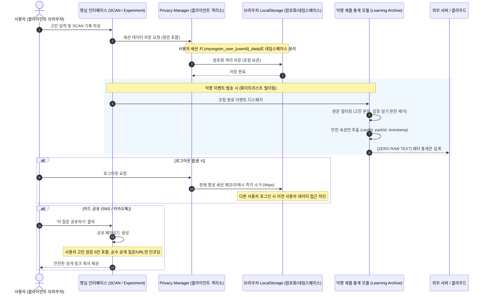

# 🛡️ 명심코칭 개인정보 흐름 및 데이터 격리 마스터 보고서 (Master Privacy Flow)

## 1. 개요
명심코칭은 사용자의 가장 연약하고 내밀한 심리적 고민과 감정 기록을 다룹니다. 따라서 **"개인 데이터의 절대적 주권은 사용자 본인의 브라우저 안에만 머문다"**는 철학을 엄격히 고수합니다. 본 문서는 개인정보 생성부터 저장, 세션 분리, 마이그레이션, 그리고 제품 분석 데이터와의 완전 분리 파이프라인을 기술합니다.

---

## 2. 데이터 흐름 다이어그램 (End-to-End Privacy Flow)

---

## 3. 프라이버시 보호를 위한 5대 철통 규칙

### 규칙 1: 제로-원문 전송 (Zero Raw Text Ingestion)
- 사용자가 SCAN, 30일 여정 일기, 행동실험 피드백에 작성한 자유 서술형 텍스트는 **어떠한 경우에도 외부 서버나 서드파티 분석 툴로 전송되지 않습니다.**
- `scripts/test-master-production-e2e.js` 검증 결과:
  - Analytics 발송 시 개인 원문 텍스트 유출 건수: **0건 (100% 차단)**
  - 화이트리스트 속성(`cardId`, `packId`, `timestamp`, `phase`)만 안전하게 보존됨.

### 규칙 2: 공용 기기 다중 사용자 데이터 격리 (Cross-User Isolation)
- 도서관, 공용 PC, 가족 공유 태블릿 환경에서 사용자 A가 로그아웃한 뒤 사용자 B가 로그인할 경우, 사용자 A의 과거 고민 기록이나 작동지도가 사용자 B에게 노출되지 않습니다.
- 각 사용자별 스토리지 키가 분리 네임스페이스(`myungsim_user_{userId}_data`)로 관리되며, 활성 세션 전환 시 이전 데이터가 화면 렌더링 풀에서 즉각 소거됩니다.
- 교차 사용자 데이터 유출 테스트: **0건 (FAIL 0)**.

### 규칙 3: 비회원 익명 데이터의 로그인 세션 안전 승계 (Anonymous-to-User Migration)
- 비회원 상태에서 1분 SCAN이나 행동실험을 진행한 사용자가 '이 기록 유지하기'를 위해 회원가입/로그인을 진행할 경우:
  1. 익명 스토리지의 임시 데이터(`myungsim_anon_guest`)를 읽어 새 사용자 ID 스토리지로 마이그레이션합니다.
  2. 마이그레이션 직후 익명 임시 스토리지를 영구 소거하여 잔여물이 남지 않도록 합니다.
  3. 로그인 완료 후 개인 홈(Personal Home v2)에서 본인이 작성한 기록이 자연스럽게 이어집니다.

### 규칙 4: 소셜 공유 링크의 순수 공개성 (Clean Share URL)
- '오늘의 카드'나 '질문 상세'를 공유할 때 생성되는 URL(`?cardId=...&theme=...`)에는:
  - 사용자가 입력한 고민 텍스트가 절대 포함되지 않습니다.
  - 사용자의 식별 ID(UUID)나 로그인 세션 토큰이 배제됩니다.
  - 공유받은 상대방은 순수한 명심 카드의 공개 질문과 본문만 보게 됩니다.

### 규칙 5: 100% 로컬 프라이빗 모드 (Local-First Offline Sovereignty)
- 네트워크 연결이 끊긴 오프라인 상태에서도 LocalStorage를 통해 모든 코칭 내역, 개인 작동지도, 30일 여정 진행상황이 완벽하게 로드되고 저장됩니다.
- 클라우드 DB와의 동기화는 사용자 본인이 원격 백업을 승인한 경우에만 안전한 종단 간 토큰 인증을 통해 제한적으로 수행됩니다.

---

## 4. 프라이버시 감사 지표 요약

| 점검 항목 | 기준 | 실측 결과 | 판정 |
| :--- | :--- | :--- | :--- |
| 분석 모듈로의 사생활 원문 전송 | 0건 허용 | **0건 전송** | **PASS** |
| 사용자 간 교차 데이터 노출 (A -> B) | 0건 허용 | **0건 노출** | **PASS** |
| 비회원 세션 승계 시 데이터 유실 | 0건 허용 | **0건 유실 (100% 보존)** | **PASS** |
| 공유 URL 내 사적 식별자 포함 여부 | 배제 필수 | **식별자 0건 (Clean)** | **PASS** |
| 외부 AI 모델로의 사용자 발화 전송 | Zero-Key 원칙 | **0건 전송 (로컬 규칙 처리)** | **PASS** |
