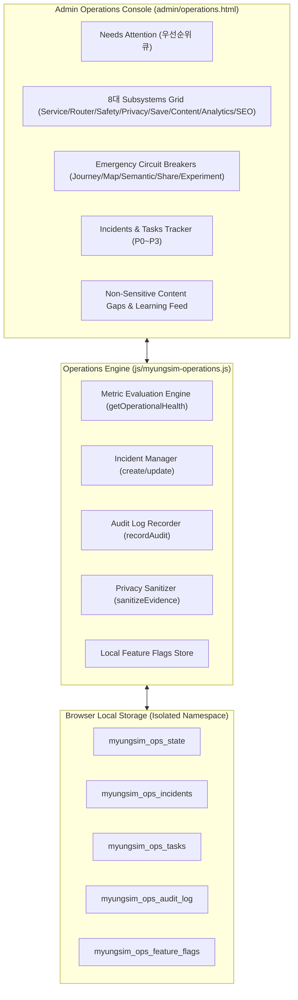

# 🏗️ 명심코칭 운영센터 아키텍처 보고서 (Operations Console Architecture)

## 1. 시스템 목적 및 철학
**MyungSim Operations Console v1**은 서비스 런칭 후 매일 시스템의 안정성, 안전성, 개인정보 보호 수준, 라우팅 품질을 비침습적으로 관제하기 위한 전용 운영 모듈입니다.
CRM 형태의 사용자 모니터링을 엄격히 금지하며, 오직 **비민감 시스템 메트릭과 집계 신호**만을 처리합니다.

---

## 2. 운영센터 컴포넌트 구조도

---

## 3. 핵심 설계 원칙
1. **Non-CRM**: 개인 식별자, 원문 텍스트, 개인 심리 상태 기록 영구 배제.
2. **Zero-Key Independence**: 운영센터 기능 전체가 외부 LLM 호출 없이 순수 자바스크립트 규칙 및 통계 엔진으로 작동.
3. **No Whole-System Kill Switch**: 전체 시스템을 중단하지 않고 결함 서브시스템만 우아하게 차단(Graceful Isolation).
4. **Human Approval**: 자동 수정이나 자동 발행을 일체 배제하고 운영자 승인 후 반영.
