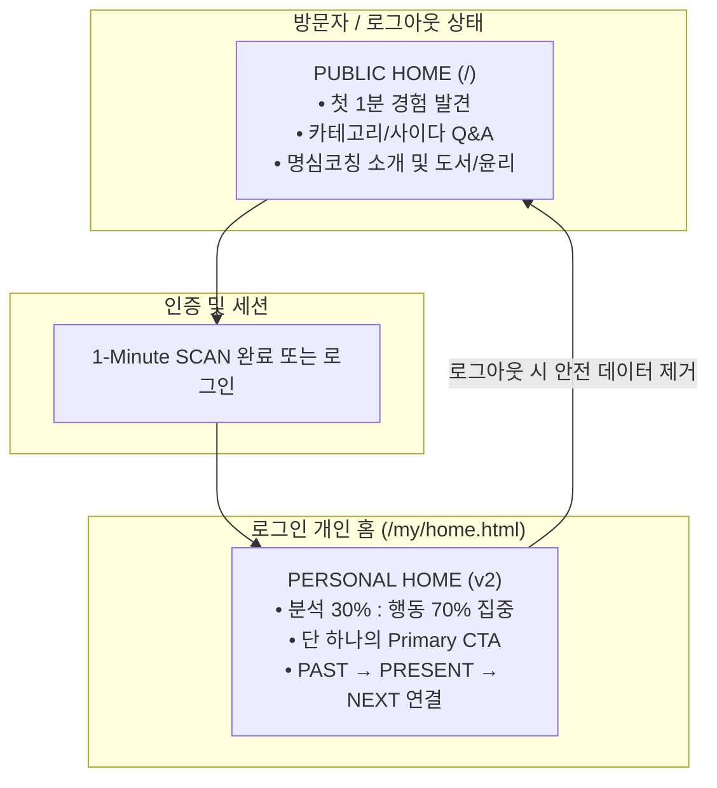
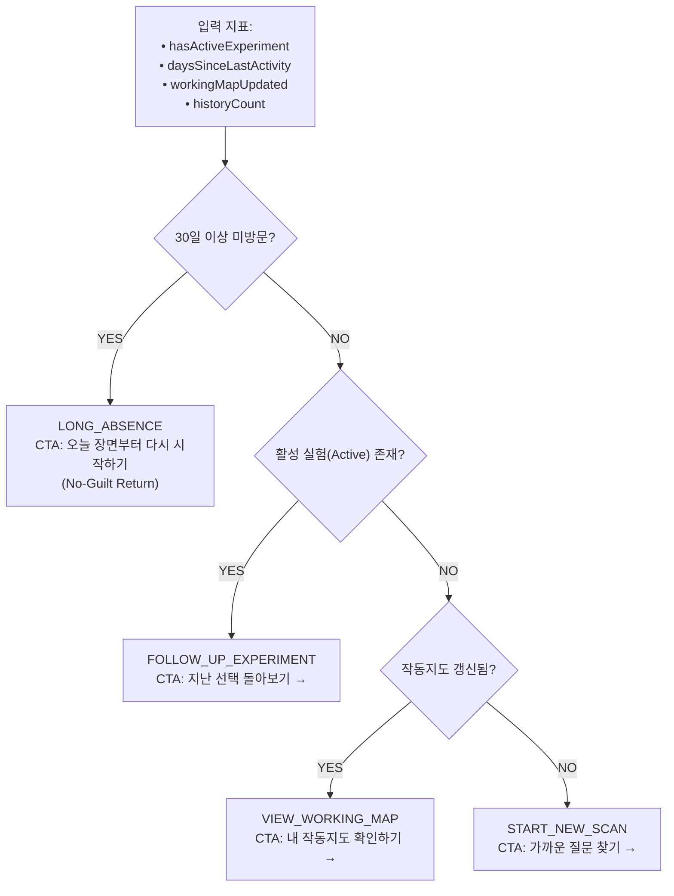

# 명심코칭 개인 홈 v2 아키텍처 보고서
(MYUNGSIM PERSONAL HOME v2 ARCHITECTURE REPORT)

> **핵심 목적:**  
> 로그인 사용자가 홈에 들어왔을 때 “무엇부터 해야 하지?” 헤매지 않도록,  
> **PAST (지난번 선택) → PRESENT (오늘의 장면) → NEXT (다음 10% 행동)**를 하나의 조화로운 화면에서 이어줍니다.

---

## 1. 공개 HOME과 개인 HOME 분리 아키텍처

명심코칭은 사용자의 방문 맥락에 따라 공개 홈과 개인 홈의 역할을 명확히 분리하면서도, 하나의 브랜드 감성을 유지합니다.

---

## 2. 7대 핵심 섹션 구조 (Mobile First 390×844)

개인 홈은 복잡한 심리 분석 대시보드가 아니라, **"오늘의 삶에서 무엇을 할 것인가"**에 집중하는 간결한 7대 섹션으로 구성됩니다.

| 순서 | 섹션명 | 구성 요소 및 사용자 경험 |
| :--- | :--- | :--- |
| **SEC 1** | **오늘 무엇이 마음에 걸리나요?** | Textarea 고민 입력, [가까운 질문 찾기] Primary CTA, [오늘의 카드] Secondary, Continuity Mode (지난 발견과 연결해서 보기) 토글 |
| **SEC 2** | **지난번 선택** | 활성 행동실험(Active Experiment) 컴팩트 카드 (있을 때만 표시, 미완료 압박/Streak 없음) |
| **SEC 3** | **최근 발견** | 최근 SCAN에서 만난 수용 문장 또는 질문 + 10% 행동 (개인 원문은 기본 숨김) |
| **SEC 4** | **내 작동지도** | `TRIGGER → STORY → URGE → ACTION` 컴팩트 파이프라인 (기록 부족 시 온화한 안내) |
| **SEC 5** | **오늘의 명심카드** | 가벼운 1장 카드 뽑기 위젯 ("미래를 맞히는 카드가 아닙니다" 운세화 방지 문구) |
| **SEC 6** | **최근 기록** | 최근 3~5개 기록 컴팩트 카드 및 [전체 기록 보기 &rarr;] 링크 |
| **SEC 7** | **책 / 앱 Deep Dive** | 31권 시리즈 원리 탐독을 위한 맥락형 링크 (상단 판매 배너/타깃팅 광고 전면 금지) |

---

## 3. Personal Home Rule Engine (NO-AI 순수 조건문 엔진)

외부 LLM/AI 호출 없이 6대 지표를 조건문으로 평가하여, 사용자가 5초 안에 무엇을 해야 할지 직관적으로 알 수 있는 **단 하나의 Primary CTA**를 결정합니다.

---

## 4. 모바일 Bottom Navigation 사양

모바일 필수 이동 동선을 보장하기 위해 4대 메뉴로 통합 구성했습니다:
- 🏡 **홈 (`/my/home.html`)**: 현재 개인 홈
- 🔍 **질문탐색 (`/library`)**: 31권 도서 및 명심 질문 카테고리 라이브러리
- 🌱 **행동실험 (`/my/experiments.html`)**: 개인 10% 행동실험실 전체 히스토리
- 🗺️ **작동지도 (`/my/working-map.html`)**: Personal Working Map 상세 파이프라인
