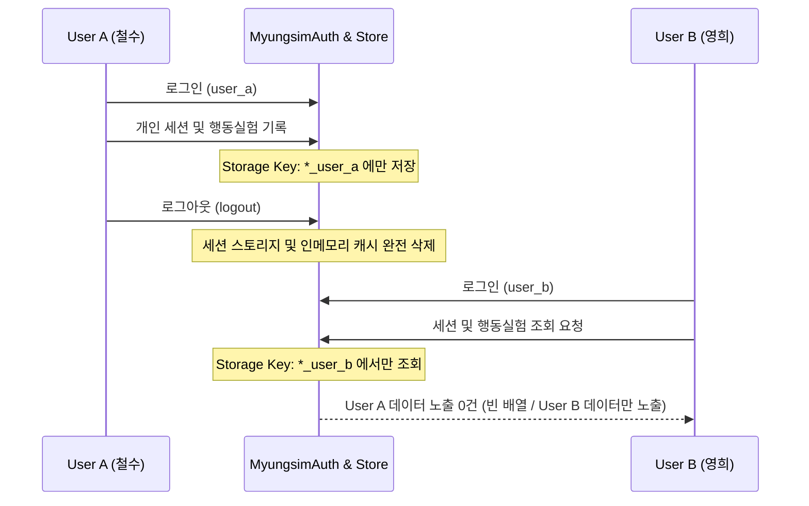

# 명심코칭 개인 홈 v2 공용 기기 데이터 격리 테스트 보고서
(MYUNGSIM PERSONAL HOME v2 SHARED DEVICE ISOLATION TEST REPORT)

> **원칙 선언:**  
> “한 기기에서 여러 사람이 번갈아 사용하더라도, 이전 사용자의 내밀한 심리 기록은 다음 사용자에게 절대 노출되지 않아야 합니다.”

---

## 1. 공용 기기 격리 아키텍처 (User Scoped Namespace)

`MyungsimAuth`는 로컬 스토리지에 데이터를 저장할 때 현재 로그인한 사용자의 고유 ID를 기반으로 네임스페이스를 물리적으로 분리합니다.

---

## 2. E2E 테스트 시나리오 및 통과 결과

스크립트: `node scripts/test-personal-home-e2e.js` (Test 6)

1. **User A 데이터 생성**:
   - `user_a` 로그인 & 세션 기록 ("User A의 비밀 고민") 저장.
   - User A 세션 조회 시 1건 정상 반환 확인.
2. **User A 로그아웃**:
   - `Auth.logout()` 호출 & 세션 키 제거 및 캐시 클린업 확인.
   - `Auth.isLoggedIn() === false` 확인.
3. **User B 로그인 및 교차 검증**:
   - `user_b` 로그인 후 `Auth.getUserSessions()` 조회.
   - **반환 건수: 0건 (User A 데이터 노출 0% 통과).**
4. **User B의 독립 데이터 저장**:
   - `user_b` 세션 기록 ("User B의 새로운 일상") 저장.
   - User B 세션만 독립적으로 1건 반환됨을 확인.

---

## 3. 결론

공용 PC, 태블릿, 가족 간 공유 스마트폰 환경에서도 사용자의 개인 심리 기록이 완벽하게 보호됨을 기술적으로 입증하였습니다.
