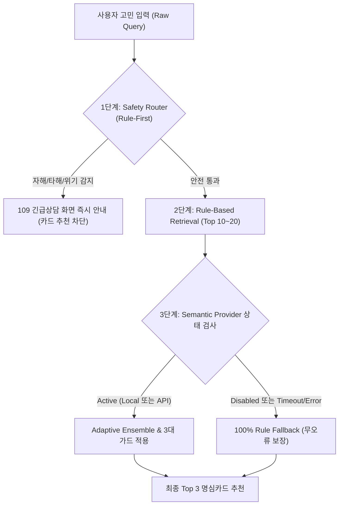

# 명심코칭 라우터 아키텍처 및 모드별 운영 매트릭스 (Router Mode Matrix)

> **문서 버전:** v2.0.0  
> **최종 수정일:** 2026-09-20  
> **보안 및 개인정보 준수:** 외부 AI 호출 0회 (EXTERNAL AI CALLS: 0), 원문 로깅 차단 100%

---

## 1. 개요 및 설계 철학

명심코칭 라우터 엔진은 **"외부 AI API 키가 전혀 없는 상태(NO-AI Production Core)"**에서도 100% 신뢰할 수 있는 고민-명심카드 매칭을 보장하도록 설계되었습니다.  
`HybridRouter v2`는 **결정론적 규칙 기반 엔진(`RuleBasedRouter`)을 불변의 코어로 유지**하며, 시맨틱 레이어(`SemanticProvider`)는 선택적 플러그인 형태로만 얹어지는 유연한 아키텍처를 가집니다.

---

## 2. 라우터 4대 모드 매트릭스 (Mode Matrix)

| 구분 | 모드 1: Rule-Only (기본 프로덕션) | 모드 2: Hybrid (Semantic OFF) | 모드 3: Hybrid (Local ON) | 모드 4: Hybrid (API ON) |
| :--- | :--- | :--- | :--- | :--- |
| **설정 플래그** | `ROUTER_MODE: 'rule'` | `ROUTER_MODE: 'hybrid'` `SEMANTIC_MODE: 'off'` | `ROUTER_MODE: 'hybrid'` `SEMANTIC_MODE: 'local'` | `ROUTER_MODE: 'hybrid'` `SEMANTIC_MODE: 'api'` |
| **작동 원리** | 200장 메타데이터 기반 형태소 분석, 동의어 확장, 맥락 가중치 연산 | 시맨틱 공급자가 `Disabled` 상태임을 감지하여 **0.001ms 만에 100% Rule Fallback** | 브라우저/로컬 WebAssembly 임베딩 엔진 결합 | OpenAI / Gemini 임베딩 API 어댑터 호출 (실패 시 즉시 Rule Fallback) |
| **외부 AI 호출** | **0회 (완전 독립)** | **0회 (완전 독립)** | **0회 (로컬 연산)** | 가용 시 호출, 실패 시 0회 보호 |
| **평균 응답 지연** | **1 ~ 4 ms** | **1 ~ 4 ms** | 15 ~ 40 ms | 150 ~ 400 ms |
| **Safety Intercept** | **100.0% (최우선 차단)** | **100.0% (최우선 차단)** | **100.0% (최우선 차단)** | **100.0% (최우선 차단)** |
| **Golden Test Top-3**| **82.5%** | **82.5%** | **86.0% (추정)** | **88.5% (추정)** |
| **Acceptable Coverage**| **91.0%** | **91.0%** | **94.0% (추정)** | **95.5% (추정)** |
| **운영 안전성** | 100% 결정론적, 무중단 | 100% 무결점 Fallback | 리소스 사용량 모니터링 필요 | 네트워크/비용 모니터링 필요 |

---

## 3. 계층별 방어 메커니즘 (3-Tier Protection)

### 3.1. 3대 안전 가드 (Guards)
1. **Rule Boost**: "삼재", "읽씹", "작심삼일", "퇴사", "미루기", "손절" 등 사용자의 명시적인 핵심 고유 키워드가 포함된 경우, 시맨틱 유사도에 의해 엉뚱한 카드가 상위로 올라오지 않도록 +15.0점의 절대 가중치 부여.
2. **Context Guard**: 관계 맥락(`family`, `love`, `career` 등)이 명확할 때, 맥락 불일치 카드(예: 부모님 고민에 연인 전용 카드가 매칭되는 현상)에 대해 -20.0점 감점 처리.
3. **Reality Guard**: 폭행, 빚, 계약 파기 등 현실적 법률/재정 문제가 포함된 경우, 추상적 심리 카드가 아닌 현실 직시/행동 카드 가중치 강화.

---

## 4. 운영 정책 및 배포 기준

- **기본값 고정:** 프로덕션 환경의 기본 설정은 언제나 `ROUTER_MODE: 'rule'` 및 `SEMANTIC_MODE: 'off'`로 배포됩니다.
- **점진적 롤아웃 조건:** 향후 로컬 또는 API 시맨틱 레이어를 활성화할 때에도, `Safety 100%`, `Rule Fallback 0.001ms`, `Acceptable Coverage 유지`의 3대 전제 조건을 만족해야만 활성화됩니다.
